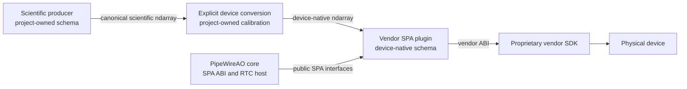

# Device plugin architecture

Status: accepted repository and interface boundary; first ALPAO sink slice implemented

Decision: PWAO-PLUGIN-001

## Context

PipeWireAO provides the transport, negotiation, buffer ownership, and execution
facilities needed by low-latency hardware integrations. Vendor SDK adapters do
not need to share the PipeWireAO source repository to use those facilities.
Keeping proprietary and site-specific adapters out of the maintained PipeWire
fork reduces core release coupling, makes SDK availability explicitly optional,
and preserves a narrow public interface between the host and its plugins.

An earlier PipeWireAO planning requirement stated that native hardware
integrations must live under the core repository's `spa/plugins` directory.
PWAO-PLUGIN-001 retains the runtime requirement that each integration be a
standard SPA factory, but removes source-tree placement as a conformance
condition. The corresponding PipeWireAO requirement must be updated before the
out-of-tree plugin is claimed as satisfying it.

## Decision

Native vendor hardware integrations maintained by this project SHALL live in
this repository as out-of-tree SPA plugins. They SHALL build against installed,
public PipeWireAO SPA interfaces and SHALL NOT depend on PipeWireAO private
headers or source-tree-relative files.

PipeWireAO core continues to own:

- the `application/ndarray` structural format;
- generic negotiated semantic-schema and profile properties;
- fixed buffer-pool and ordinary graph ownership contracts;
- regular graph scheduling, data-loop idle policies, and activation wake policies;
- metadata ABIs and generic SPA format utilities; and
- the host-side discovery, loading, lifecycle, and graph integration needed by
  ordinary SPA factories.

This repository owns:

- vendor device and node factories;
- device discovery, selection, controls, and lifecycle;
- translation between SPA buffers and the vendor SDK ABI;
- vendor-native semantic schemas and profile definitions;
- optional SDK discovery at build and runtime; and
- SDK-independent, simulator, and connected-hardware qualification.

Scientific application repositories own their scientific schemas. A vendor
plugin SHALL NOT advertise a device-native quantity as a canonical scientific
quantity merely because their element type and shape match.

## Component boundary

The diagram shows code ownership and runtime authority. Repository boundaries
do not add a proxy process or a second transport.



The conversion may later be fused into a vendor plugin only when that plugin
owns a qualified conversion profile and explicitly accepts the corresponding
scientific schema. Device-native values remain internal in that design. A
plugin that does not own that conversion must expose the device-native schema
honestly and require an explicit upstream conversion.

## Negotiated device-native format

The first proposed device contract is the normalized actuator vector accepted
by the ALPAO deformable-mirror SDK:

```text
mediaType    = application
mediaSubtype = ndarray
schema       = org.pipewireao.alpao.normalized-actuator-command/1
elementType  = F64_LE
shape        = [468]
layout       = ROW_MAJOR
profile      = sha256:<command-profile-fingerprint>
rate         = ...
```

This contract has the following interpretation:

| Property | Owner | Meaning |
| --- | --- | --- |
| `mediaType`, `mediaSubtype` | PipeWireAO SPA ABI | The payload is a packed application ndarray. |
| `elementType`, `shape`, `layout`, `rate` | PipeWireAO ndarray ABI | Scalar representation, logical extent, storage order, and optional negotiated cadence. |
| `schema` property | PipeWireAO generic ABI | Exact semantic contract identifier used during format negotiation. |
| schema value | This repository | Each element is one ALPAO SDK normalized actuator command in the interval `[-1,+1]`, under schema version 1. |
| `profile` property | PipeWireAO generic ABI | Exact negotiated identity of a command interpretation that is not determined by structural format and schema alone. |
| profile value | This repository and deployment configuration | Fingerprint of the command profile that fixes actuator order and every other profile-owned interpretation required by the schema. |

`BAX307` is a mirror serial number and configuration identity; it is not a
schema name or a reusable model type. Manufacturer, model when available,
serial number, transport, SDK version, and configuration location belong to
device or node properties. Only information that changes the meaning of the
command vector participates in format negotiation.

The plugin currently requires an exact lowercase `sha256:` identifier but
treats it as a trusted opaque deployment input. The profile fingerprint format,
canonical profile manifest, and compatibility rules remain unresolved. They
must be specified and covered by byte-stable test vectors before the ALPAO
format is promoted as a stable contract. Hashing an incidental path, an
unordered property map, or an entire SDK installation is not an acceptable
profile definition.

The `rate` property is present only when it expresses a negotiated command
cadence. It SHALL NOT be used for an SDK polling frequency, a device capability
advertisement, or an unverified maximum rate.

The ALPAO DEv7 `daqFreq` parameter controls the digital to analog conversion
rate for supported interfaces, including PEX-292144. It is a device operational
setting, not the graph command cadence. The ALPAO sink exposes it as
`api.alpao.daq-frequency` in integer hertz and applies it during device startup.
It SHALL NOT be copied into the ndarray `rate` property.

## Calculon boundary

Calculon physical-deformable-mirror commands use canonical micrometres of
wavefront. The ALPAO SDK consumes normalized actuator values. These are distinct
semantic schemas even when both payloads are rank-one floating-point arrays of
the same length.

The first implementation therefore uses this boundary:

```text
Calculon demanded physical-DM command in micrometres of wavefront
    -> explicit calibrated conversion
    -> ALPAO normalized actuator command in [-1,+1]
    -> ALPAO SPA sink
```

The ALPAO plugin SHALL reject a missing or mismatched schema or profile during
format negotiation. It SHALL NOT infer compatibility from vector length,
scalar type, serial number, filename, or numerical magnitude.

## Build and distribution contract

The repository SHALL use an out-of-tree build against the installed
PipeWireAO development package. It SHALL NOT include PipeWireAO as a copied
source subtree merely to reach private interfaces.

Each proprietary SDK integration SHALL be an optional build feature. A build
with that feature disabled SHALL NOT inspect, include, link, load, or package
the SDK. The ALPAO development override is expected to accept an unpacked SDK
root such as:

```console
-Dalpao-sdk-root=/home/user/workspaces/alpao
```

The override is a development input, not an installation layout or a path to
record in installed plugin metadata. Production deployments use a supported
system SDK installation and explicitly provision device configuration and
drivers.

Plugins SHALL use C by default. A plugin MAY use C++ when its vendor SDK or a
specific implementation requirement makes C++ necessary. The reason must be
recorded at that plugin boundary. The ALPAO plugin uses the vendor's C wrapper;
the eGrabber SDK is an example of a boundary that requires C++.

An SDK-independent mock SHALL cover each device plugin's SPA contract in
automated tests. A mock that accepts and discards hardware commands SHALL NOT
be included in the installed hardware plugin unless it has a distinct factory
identity and an explicitly documented operational use. The ALPAO mock is
compiled only into a non-installed test plugin; the installed factory accepts
only the ASDK backend when ASDK support is built.

The repository SHALL NOT commit or redistribute:

- vendor headers or libraries unless redistribution authority is recorded;
- SDK installers or driver packages;
- mirror configuration and calibration files;
- device serials embedded in fixtures; or
- reverse-engineering inputs that are not independently redistributable.

Synthetic fixtures must define their own non-device identity and must not be
presented as vendor calibration.

## Scheduling and lifecycle contract

The regular PipeWire scheduler owns dependency ordering for every production
factory. Sources set `node.driver=true`. A source reports
`SPA_NODE_FLAG_POLL_DRIVER` only when its configured execution profile requires
a bounded, nonblocking `process()` probe on a busy-spin data loop. BGAPI2 and
FITS also provide ordinary eventfd and timerfd readiness profiles. Aravis and
eGrabber remain polling sources; eGrabber publishes either complete video
frames or copied, complete row-block ndarrays. ALPAO is an ordinary scheduled
follower and accepts `SPA_IO_Buffers`.

The EDT PDV source is also a polling source. It probes EDT's cumulative DMA
completion count without blocking and copies the latest completed raw EDT ring
buffer into a graph-owned SPA buffer. This copy is the ownership boundary
between EDT's continuously reused DMA ring and the graph. Sequence gaps,
timeouts, and overruns are surfaced through standard frame metadata.

The FliSdk source is a polling source with an asynchronous vendor callback at
its device boundary. It disables FliSdk's internal ring buffer and requests the
callback before FliSdk's ring copy. The callback copies directly from the
frame-grabber image into an available graph-owned SPA buffer under a bounded
buffer-state handoff. The polling graph thread publishes completed buffers;
callbacks never call graph hooks. A missing free SPA buffer drops that frame,
and the callback sequence makes the gap visible as a Header discontinuity.

A polled source does not bypass the graph. One successful source publication
starts one normal graph cycle; the source is not probed again until the graph's
completion dependency returns to the driver. Local poll drivers require a
busy-spin loop. Exported nodes poll in the implementation process, while the
daemon-side remote representation retains topology and the shared activation.

Factory identity, discovery, formats, schemas, controls, metadata, and SDK
ownership are independent of the selected loop and readiness profile. Startup
occurs only after format, buffers, I/O, required ports, and device state are
prepared. Pause, Suspend, final link removal, and destruction synchronously
quiesce polling or fd readiness before SDK or buffer teardown, so lifecycle
calls cannot overlap `process()`.

A source SHALL reject a buffer pool in `port_use_buffers()` when any buffer
lacks metadata that the source writes during publication, or when that metadata
is smaller than its public SPA structure. It SHALL NOT accept the pool and then
turn the same permanent admission error into a repeated data-loop failure.

After a failed start discards a vendor producer queue, the plugin SHALL clear
the corresponding local queued state before returning. A later `Start` must
therefore offer every eligible buffer again instead of relying on queue state
that the vendor has already discarded.

A writable control that can change payload layout SHALL be failure-atomic with
respect to the last advertised SPA format. The plugin SHALL read the old value,
apply the requested value, refresh and validate the complete resulting layout,
and publish new format parameters only after validation succeeds. If validation
fails, it SHALL restore the old value and verify the restored layout. If that
verification fails, the plugin SHALL invalidate its current format and refuse
format enumeration, selection, and activation until a later successful layout
control establishes a representable layout.

The changing eGrabber camera allocation remains private in row-block mode.
Only complete copied row-block ndarrays cross its output port. See
[Scheduled nodes and row-block ndarrays](scheduled-node-migration.md).

Vendor calls that allocate, lock, wait, perform I/O, or have unbounded work must
be identified and qualified. A functional SDK call is not by itself evidence
for strict BusySpin admission.

## Repository layout

```text
pipewireao-spa-plugins/
├── meson.build
├── meson_options.txt
├── docs/
│   ├── device-plugin-architecture.md
│   └── schemas/
├── include/
│   └── pipewireao-plugins/
├── spa/
│   └── plugins/
│       ├── alpao/
│       ├── andor3/
│       ├── bgapi2/
│       ├── edtpdv/
│       └── egrabber/
└── tests/
```

Shared headers are admitted only for vocabulary or support code genuinely used
by more than one plugin. Vendor-specific concepts remain under the vendor
plugin.

## Delivery sequence

### 1. PipeWireAO generic format support

Add the generic ndarray semantic-schema and profile properties to PipeWireAO,
including type information, builders, parsers, filtering behavior, ABI values,
and negotiation tests.

Completion evidence: two structurally identical ndarrays with different schema
or profile values fail negotiation, while exact values link successfully.

### 2. SDK-independent ALPAO contract

Define the ALPAO schema, profile identifier requirements, SPA factory identity,
fixed input format, lifecycle state, and a test-only synthetic backend that
never opens physical hardware. Canonical profile serialization and fingerprint
generation remain a separate promotion requirement.

Completion evidence: factory loading, format enumeration, schema/profile
rejection, buffers, commands, start/pause, bounded empty processing, and safe
teardown pass without the proprietary SDK.

### 3. Optional ALPAO SDK backend

Add SDK detection, device selection, configuration, normalized-command
submission, error translation, and safe-state behavior without changing the
SDK-independent SPA contract.

Completion evidence: SDK-disabled builds remain clean; SDK-enabled simulator or
non-hardware tests pass with an unpacked development SDK; the loaded plugin has
no undeclared runtime dependency.

### 4. Connected-device qualification

Qualify actuator ordering, normalization, profile matching, start/pause/reset,
command pacing, failure behavior, safe state, shutdown, warmed allocations,
locks, waits, and latency on the target host.

Completion evidence must distinguish functional operation from strict RTC
admission and record the exact SDK, driver, firmware, configuration, profile,
PipeWireAO, plugin, kernel, and host revisions.

### 5. Additional vendor plugins

Add other adapters independently. An existing in-tree plugin may move here only
after the public installed SPA interface proves sufficient and one release
does not install duplicate factories from both repositories.

The eGrabber and BGAPI2 sources satisfied this gate on 2026-08-23. Both build
only against the public `libspa-ao-0.2` package, and their complete connected
camera matrix passes from this repository. Their factory identities and SPA
install paths did not change during migration.

The Andor SDK3 source follows the same public SPA boundary but uses SDK3's
typed feature API directly. It preserves SDK3 feature identifiers and units
under `andor3.*`; the GenICam-like shape of the vendor GUI does not make SDK3 a
GenApi node map.

## Validation matrix

| Layer | Required evidence |
| --- | --- |
| Vocabulary | Stable property IDs, schema strings, profile test vectors, C ABI and binding parity where applicable. |
| Build | Clean SDK-disabled build; explicit SDK-root build; install and load against a supported installed PipeWireAO. |
| SPA contract | Factory enumeration, parameters, exact format filtering, ordinary buffer I/O, commands, and lifecycle. |
| Failure | Missing SDK, missing configuration, mismatched profile, malformed payload, device rejection, timeout, and teardown with work active. |
| Repeated path | Bounded work, allocation and lock evidence, wait behavior, latency distribution, and overload policy. |
| Deployment | Package contains no proprietary artifact and resolves only declared runtime dependencies. |

## Non-goals

- Defining Calculon's scientific algorithm schemas.
- Deciding whether numerical algorithms should be SPA plugins, client filter
  nodes, or language-local calls.
- Making PipeWireAO interpret ALPAO commands.
- Treating vector extent as an actuator-order contract.
- Redistributing or installing vendor SDKs and drivers.
- Reimplementing generic camera buffer transport or RTC scheduling in a vendor
  plugin.

## Completion criteria

PWAO-PLUGIN-001 is delivered when:

1. PipeWireAO exposes every required generic interface through installed public
   headers and package metadata.
2. The ALPAO plugin builds in this repository without a PipeWireAO source-tree
   dependency.
3. SDK-disabled and SDK-enabled validation both pass at their declared levels.
4. Schema and profile mismatches fail before device activation.
5. Installed packaging contains no unauthorized proprietary or device-specific
   artifact.
6. PipeWireAO documentation no longer requires source-tree placement for a
   conforming native hardware SPA plugin.
