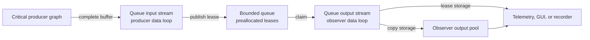

# Bounded queue module

Status: implemented; live-graph and latency qualification remain open

Decision: PWAO-PLUGIN-003

Baseline: `pipewireao-spa-plugins` `main` at `344d763`

Applicable profiles: complete-buffer `application/ndarray` streams on Linux

## Purpose and authority

This document is the normative contract for the out-of-tree
`libpipewire-module-queue` module. It owns the queue configuration vocabulary,
capacity and overload behavior, payload-storage modes, lease lifetime,
execution boundary, lifecycle, and counters.

The negotiated ndarray format and metadata ABIs remain owned by PipeWireAO.
Device and algorithm plugins remain responsible for the semantic validity of
the products they publish. Deployment configuration owns graph-driver and data
loop placement. This module does not define a scientific product, clock, or
scheduling policy.

Uppercase requirement terms use the meanings defined by BCP 14 (RFC 2119 and
RFC 8174). Lowercase forms are ordinary prose.

## Terminology

- A **queued buffer** is a complete input buffer accepted by the module but not
  yet claimed by its output side.
- An **in-flight buffer** has been published by the output side and has not yet
  been returned by its downstream consumer.
- **Backpressure** means that the module retains capacity and stops completing
  input work. It does not mean that a thread waits in a blocking system call.
- **Copy storage** copies the selected complete payload once, on the output
  side, into the output link's buffer pool.
- **Lease storage** makes the output pool refer to the input payload storage
  and retains the input buffer until the corresponding output buffer returns.
- A **replacement** occurs when `drop-oldest` removes the oldest queued buffer
  to admit a new buffer.

The public term is `overflow`, not `leaky`. GStreamer's `leaky` property is an
informative precedent, but it is not a compatibility boundary and its
directional values are not used here.

## Configuration

| Property | Required value |
| --- | --- |
| `queue.max-buffers` | Decimal integer from 1 through 62. |
| `queue.overflow` | `backpressure`, `drop-oldest`, or `drop-newest`. |
| `queue.storage` | `copy` or `lease`. |
| `capture.props` | Optional PipeWire properties for the input stream. |
| `playback.props` | Optional PipeWire properties for the output stream. |

There are no implicit aliases or silent mode fallbacks. In particular,
`latest`, `leaky`, `zero-copy`, and GStreamer-style `upstream` or `downstream`
values are not accepted configuration vocabulary.

The recommended observer-isolation profile is:

```ini
queue.max-buffers = 1
queue.overflow = drop-oldest
queue.storage = copy
```

`queue.storage = lease` selects the bounded zero-payload-copy alternative.

A PipeWire configuration fragment can load the module as follows:

```ini
context.modules = [
    {
        name = libpipewire-module-queue
        args = {
            queue.max-buffers = 1
            queue.overflow = drop-oldest
            queue.storage = copy
            capture.props = {
                node.name = telemetry-queue-input
            }
            playback.props = {
                node.name = telemetry-queue-output
            }
        }
    }
]
```

The input and output are ordinary PipeWire nodes and must be linked by the
deployment or session manager. The output node is created only after the input
has negotiated its exact ndarray format and buffer pool.

## Boundary and execution model



The input and output streams are separate PipeWire nodes. The input process
callback executes with the producer graph. The output process callback executes
with the observer graph. Publication does not wake the output graph; the
observer graph provides its own pacing. This deliberate polling boundary avoids
an eventfd write or another notification system call in the producer callback.

`backpressure` uses an asynchronous reverse-loop invocation when output
progress makes room for a retained arrival. That recovery can wake the producer
data loop. It does not run on the producer publication path, but it is another
reason that `backpressure` is not the observer-isolation profile.

### QUEUE-001 — Ordinary complete-buffer boundary

The module MUST expose one input stream and one output stream using ordinary
PipeWire complete-buffer transport. It MUST negotiate one exact
`application/ndarray` format on the input and advertise that exact format on
the output. It MUST NOT require PipeWireAO latest-buffer or progressive-buffer
I/O.

Verification intent (informative): inspect stream flags and negotiated PODs;
exercise an exact ndarray format without latest-buffer I/O.

### QUEUE-002 — Finite capacity and admission

The module MUST reject `queue.max-buffers` outside 1 through 62. For capacity
`N`, it MUST request and validate at least `N + 2` input buffers before
streaming. It MUST retain no more input buffers than the negotiated finite
pool, including queued, in-flight, completing, and transport-held buffers.

Verification intent (informative): boundary tests for 0, 1, 62, and 63;
saturation tests that account for every negotiated input buffer.

### QUEUE-003 — Overflow policy

When the queue is full, the module MUST apply exactly the selected
`queue.overflow` policy:

- `backpressure` MUST preserve queued order and MUST NOT discard a queued or
  arriving buffer as an overflow action;
- `drop-oldest` MUST release the oldest queued input buffer and admit the
  arriving buffer; and
- `drop-newest` MUST release the arriving input buffer without changing the
  queued buffers.

The module MUST preserve FIFO order among buffers that are neither replaced nor
dropped. A drop policy MUST NOT wait for output capacity.

Verification intent (informative): deterministic capacity-one and multi-slot
tests for all policies, including recovery after pressure subsides.

### QUEUE-004 — Storage modes

With `queue.storage=copy`, the input process callback MUST NOT copy payload
bytes. The output process callback MUST copy each delivered payload at most once
into an output-link buffer and MUST release the corresponding input lease after
the copy completes.

With `queue.storage=lease`, the module MUST NOT copy payload bytes. It MUST
admit only stable shareable input storage that can back the corresponding
output buffers, and it MUST retain each input lease until its output buffer is
returned. Unsupported storage MUST fail configuration; the module MUST NOT
fall back to copy storage.

Verification intent (informative): pointer or file-descriptor identity checks
for lease storage, mutation isolation for copy storage, and negative admission
tests for unshareable storage.

The initial implementation accepts at most eight data blocks and 32 metadata
records per buffer. Copy storage requires CPU-mapped input data. Lease storage
requires every data block to be a shareable `MemFd` or `DmaBuf`. Progressive
metadata and explicit `SyncTimeline`/`SyncObj` DMA synchronization are rejected
in this version; supporting them requires a separate synchronization contract,
not a silent fallback.

### QUEUE-005 — Producer repeated path

After preparation, the module's input process callback MUST use bounded work
and preallocated state. Its ordinary publication and drop paths MUST NOT
allocate memory, copy payload bytes, acquire a blocking lock, read a clock,
format or emit a log message, or directly invoke a file-descriptor system call.
One input callback MUST inspect no more buffers than the negotiated input-pool
cardinality.

Verification intent (informative): source inspection, allocator interposition,
bounded-work tests, and syscall tracing around a warmed producer path.

### QUEUE-006 — Format, metadata, and gaps

The output MUST preserve the exact negotiated format, each negotiated metadata
record, every data-block chunk description, and the complete payload selected
for delivery. Sequence and acquisition metadata MUST remain unchanged.
Replacement and drop counters MUST make lost sequence positions observable;
the module MUST NOT renumber products to hide a gap.

Verification intent (informative): multi-block payload, Header, Acquisition,
chunk, and sequence-gap tests in both storage modes.

### QUEUE-007 — Lifecycle and lease recovery

Pause, format removal, stream removal, module destruction, and configuration
failure MUST prevent new publication and MUST return every retained input and
output lease before their owning pools are destroyed. Restart after a clean
pause MUST begin with an empty queue and reset per-slot ownership state while
preserving cumulative counters.

Verification intent (informative): stop and destroy at empty, queued,
in-flight, completing, and backpressured states; then restart where supported.

### QUEUE-008 — Observability

The module MUST maintain monotonic counters for input publications,
deliveries, replacements, dropped arrivals, backpressure observations,
completions, output-pool exhaustion, and protocol errors. Counter updates on a
process path MUST be bounded and MUST NOT log per event.

Verification intent (informative): compare counters with deterministic event
histories and saturation scenarios.

### QUEUE-009 — Observer isolation claim

The `drop-oldest` and `drop-newest` policies MUST bound the input leases
retained by a stalled observer according to QUEUE-002. Copy storage MUST release
an input lease after the output-side copy, so subsequent downstream retention
uses only the observer output pool. Lease storage MAY retain one input lease
for the in-flight output in addition to queued leases.

Backpressure is not an observer-isolation policy: a stalled observer is allowed
to exhaust the finite input pool and stall its producer graph.

Verification intent (informative): deliberately stall the output for each
policy and storage mode and account for retained leases and producer progress.

### QUEUE-010 — Placement and claim limits

The module MUST use distinct default node groups for its input and output
streams. A deployment claiming control-path isolation MUST place the output
stream and observer outside the critical producer's driver group and data loop.
Functional or unit evidence MUST NOT be presented as proof of a latency bound,
system-call absence inside PipeWire itself, scheduler isolation, or hardware
performance.

Verification intent (informative): inspect the live graph and thread placement;
use a fixed-arrival latency qualification with one deliberately stalled
observer before promoting an operational isolation claim.

## Ownership and publication

The input callback is the single producer for the pending ring. The output
callback is its single consumer. Both may advance the pending read position:
the output advances it when claiming the oldest buffer, and the producer may
advance it only to implement `drop-oldest`. The implementation therefore uses
an atomic compare-and-exchange to assign each oldest slot to exactly one side.

The input callback is the single consumer of the completion ring. The output
callback is its single producer. A release publication of the pending write
position makes the initialized slot visible to an acquire-reading output. A
successful acquire-release claim of the pending read position transfers the
slot lease. The completion ring uses the same release/acquire publication
direction in reverse.

Payload mutation completes before the upstream producer publishes the input
buffer to PipeWire. This module treats the input lease as immutable. Copy
storage creates an observer-owned mutable copy before output publication;
lease storage preserves immutability until downstream release.

The pending read index, pending write index, queue storage, input counters,
output counters, and fatal-error flag occupy separate cache-line-aligned
regions. Module state is allocated at the same alignment. This layout avoids
unrelated producer/observer counter traffic sharing the publication cache
lines; it does not eliminate the cache transfer required to publish or claim a
slot.

## Counters

The module publishes cumulative decimal counters as module properties once at
initialization and then once per second:

| Property | Meaning |
| --- | --- |
| `queue.stats.publications` | Complete input buffers observed. |
| `queue.stats.replacements` | Queued inputs displaced by `drop-oldest`. |
| `queue.stats.dropped-arrivals` | Arriving inputs discarded by `drop-newest`. |
| `queue.stats.backpressure` | Arrivals retained because the queue was full. |
| `queue.stats.deliveries` | Buffers published on the output stream. |
| `queue.stats.completions` | Input leases completed by the output side. |
| `queue.stats.pool-exhaustions` | Output cycles without a reusable copy buffer. |
| `queue.stats.protocol-errors` | Ownership or layout invariant failures. |

Counters are monotonic for the module lifetime. Pause and restart clear queued
ownership but do not reset them.

## Non-goals

- An unbounded queue or dynamically growing repeated-path storage.
- Byte, duration, or watermark capacity in the first profile.
- A producer-side notification, eventfd write, timer, or busy-wait loop.
- Progressive or partially committed payloads.
- Semantic joins, timestamp rendezvous, zero-order hold, or missing-input
  policy.
- A claim that zero-copy is faster than copy storage without measurement.
- Compatibility with GStreamer queue property names.

## Current verification boundary

Automated tests cover configuration boundaries and aliases, capacity-one and
multi-slot FIFO/overflow behavior, recovery after deterministic backpressure,
a 200,000-publication concurrent `drop-oldest` stress run, multi-block payload
and metadata copying, MemFd lease identity, module loading, initial counters,
capture-node default grouping, AddressSanitizer/UndefinedBehaviorSanitizer, and
ThreadSanitizer on the concurrent ring test.

Those tests do not yet exercise an end-to-end linked PipeWire graph, downstream
stall during live capture, format renegotiation with outstanding leases,
latency distributions, or syscall tracing. The implementation ledger therefore
keeps those claims open even though their code paths are present.
