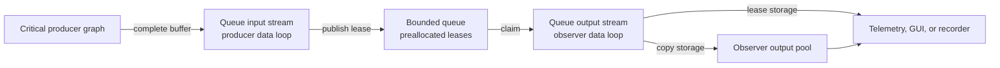

# Bounded queue module

Status: implemented and live-graph tested; deployment latency qualification
remains open

Decision: PWAO-PLUGIN-003

Baseline: `pipewireao-spa-plugins` `main` at `344d763`

Applicable profiles: complete-buffer `application/ndarray` and `video/raw`
streams on Linux

## Purpose and authority

This document is the normative contract for the out-of-tree
`libpipewire-module-queue` module. It owns the queue configuration vocabulary,
capacity and overload behavior, payload-storage modes, lease lifetime,
execution boundary, lifecycle, and counters.

The negotiated ndarray, raw-video, and metadata ABIs remain owned by PipeWireAO.
Device and algorithm plugins remain responsible for the semantic validity of
the products they publish. Deployment configuration owns graph-driver and data
loop placement. This module does not define a scientific product, clock, or
scheduling policy.

Uppercase requirement terms use the meanings defined by BCP 14 (RFC 2119 and
RFC 8174). Lowercase forms are ordinary prose.

## Terminology

- A **queued buffer** is a complete input buffer accepted by the module but not
  yet claimed by its output side.
- An **in-flight buffer** has been published by the output side and has not yet
  been returned by its downstream consumer.
- **Backpressure** means that the module retains capacity and stops completing
  input work. It does not mean that a thread waits in a blocking system call.
- **Copy storage** copies the selected complete payload once, on the output
  side, into the output link's buffer pool.
- **Lease storage** makes the output pool refer to the input payload storage
  and retains the input buffer until the corresponding output buffer returns.
- A **replacement** occurs when `drop-oldest` removes the oldest queued buffer
  to admit a new buffer.

The public term is `overflow`, not `leaky`. GStreamer's `leaky` property is an
informative precedent, but it is not a compatibility boundary and its
directional values are not used here.

## Configuration

| Property | Required value |
| --- | --- |
| `queue.max-buffers` | Decimal integer from 1 through 62. |
| `queue.overflow` | `backpressure`, `drop-oldest`, or `drop-newest`. |
| `queue.storage` | `copy` or `lease`. |
| `queue.media` | Optional `application/ndarray` (default) or `video/raw`. |
| `capture.props` | Optional PipeWire properties for the input stream. |
| `playback.props` | Optional PipeWire properties for the output stream. |

There are no implicit aliases or silent mode fallbacks. In particular,
`latest`, `leaky`, `zero-copy`, and GStreamer-style `upstream` or `downstream`
values are not accepted configuration vocabulary.

The recommended observer-isolation profile is:

```ini
queue.max-buffers = 1
queue.overflow = drop-oldest
queue.storage = copy
queue.media = application/ndarray
```

`queue.storage = lease` selects the bounded zero-payload-copy alternative.

For row-block camera processing, place the queue after complete-frame
assembly, not between row-block producers and the assembler:

```text
eGrabber -> pixel calibration -> frame assembly -> capacity-one queue -> GUI
```

This makes the queue's input a complete immutable frame ndarray, as required
by QUEUE-001, and leaves row-block sequencing inside the real-time graph.

A PipeWire configuration fragment can load the module as follows:

```ini
context.modules = [
    {
        name = libpipewire-module-queue
        args = {
            queue.max-buffers = 1
            queue.overflow = drop-oldest
            queue.storage = copy
            queue.media = application/ndarray
            capture.props = {
                node.name = telemetry-queue-input
            }
            playback.props = {
                node.name = telemetry-queue-output
            }
        }
    }
]
```

The input and output are ordinary PipeWire nodes and must be linked by the
deployment or session manager. Both endpoint nodes exist for the lifetime of
the module. Before the first input negotiation, the output advertises no
usable complete-buffer format. During a later input-pool transition it retains
the last exact contract but publishes no frame; the next prepared input pool
replaces that contract in place.

The module publishes the same opaque `pipewireao.queue.id` property on both
endpoint nodes. Graph clients MUST use that identity when they need to relate
the output endpoint to its input endpoint; client identity, media name, node
group, and link group are not unique queue identities. The value is owned by
the module instance and is not a configuration property.

## Boundary and execution model



The input and output streams are separate PipeWire nodes. The input process
callback executes with the producer graph. The output process callback executes
with the observer graph. Publication does not wake the output graph; the
observer graph provides its own pacing. This deliberate polling boundary avoids
an eventfd write or another notification system call in the producer callback.

`backpressure` uses an asynchronous reverse-loop invocation when output
progress makes room for a retained arrival. That recovery can wake the producer
data loop. It does not run on the producer publication path, but it is another
reason that `backpressure` is not the observer-isolation profile.

For a complete-frame camera observer, the queue forwards the source's exact
raw-video format without converting it:

```text
eGrabber Video/Source -> capacity-one queue -> GUI video observer
```

That deployment MUST set `queue.media=video/raw`. Selecting one media family
at module creation keeps input format negotiation deterministic; the exact
format details are still copied from the source to the output.

### QUEUE-001 — Ordinary complete-buffer boundary

The module MUST expose one input stream and one output stream using ordinary
PipeWire complete-buffer transport. It MUST accept the media family selected
by `queue.media`, negotiate one exact `application/ndarray` or `video/raw`
format on the input, and advertise that exact format on the output. It MUST
NOT require a private buffer-ownership protocol on either side.

Verification intent (informative): inspect stream flags and negotiated PODs;
exercise exact ndarray and raw-video formats through ordinary stream I/O.

### QUEUE-002 — Finite capacity and admission

The module MUST reject `queue.max-buffers` outside 1 through 62. For capacity
`N`, it MUST request and validate at least `N + 2` input buffers before
streaming. It MUST retain no more input buffers than the negotiated finite
pool, including queued, in-flight, completing, and transport-held buffers.

Verification intent (informative): boundary tests for 0, 1, 62, and 63;
saturation tests that account for every negotiated input buffer.

### QUEUE-003 — Overflow policy

When the queue is full, the module MUST apply exactly the selected
`queue.overflow` policy:

- `backpressure` MUST preserve queued order and MUST NOT discard a queued or
  arriving buffer as an overflow action;
- `drop-oldest` MUST release the oldest queued input buffer and admit the
  arriving buffer; and
- `drop-newest` MUST release the arriving input buffer without changing the
  queued buffers.

The module MUST preserve FIFO order among buffers that are neither replaced nor
dropped. A drop policy MUST NOT wait for output capacity.

Verification intent (informative): deterministic capacity-one and multi-slot
tests for all policies, including recovery after pressure subsides.

### QUEUE-004 — Storage modes

With `queue.storage=copy`, the input process callback MUST NOT copy payload
bytes. The output process callback MUST copy each delivered payload at most once
into an output-link buffer and MUST release the corresponding input lease after
the copy completes.

With `queue.storage=lease`, the module MUST NOT copy payload bytes. It MUST
admit only stable shareable input storage that can back the corresponding
output buffers, and it MUST retain each input lease until its output buffer is
returned. Unsupported storage MUST fail configuration; the module MUST NOT
fall back to copy storage.

Verification intent (informative): pointer or file-descriptor identity checks
for lease storage, mutation isolation for copy storage, and negative admission
tests for unshareable storage.

The initial implementation accepts at most eight data blocks and 32 metadata
records per buffer. Copy storage requires CPU-mapped input data. Lease storage
requires every data block to be a shareable `MemFd` or `DmaBuf`. Explicit
`SyncTimeline`/`SyncObj` DMA synchronization is rejected in this version;
supporting it requires a separate synchronization contract, not a silent
fallback.

### QUEUE-005 — Producer repeated path

After preparation, the module's input process callback MUST use bounded work
and preallocated state. Its ordinary publication and drop paths MUST NOT
allocate memory, copy payload bytes, acquire a blocking lock, read a clock,
format or emit a log message, or directly invoke a file-descriptor system call.
One input callback MUST inspect no more buffers than the negotiated input-pool
cardinality.

Verification intent (informative): source inspection, allocator interposition,
bounded-work tests, and syscall tracing around a warmed producer path.

### QUEUE-006 — Format, metadata, and gaps

The output MUST preserve the exact negotiated format, each negotiated
application metadata record, every data-block chunk description, and the
complete payload selected for delivery. Sequence and acquisition metadata MUST
remain unchanged. PipeWire's transport-owned `SPA_META_Busy` record MUST remain
link-local and MUST NOT be copied between the input and output links.
Replacement and drop counters MUST make lost sequence positions observable;
the module MUST NOT renumber products to hide a gap.

Verification intent (informative): multi-block payload, Header, Acquisition,
chunk, and sequence-gap tests in both storage modes.

### QUEUE-007 — Lifecycle and lease recovery

Pause, format removal, stream removal, module destruction, and configuration
failure MUST prevent new publication. The module MUST empty its pending and
completion queues and MUST account for every retained input and output lease
before the corresponding pool storage can be reused or released. A clean pause
MAY retain the current negotiated pool, but restart MUST begin with an empty
pending queue and MUST preserve cumulative counters. Format or pool withdrawal
starts a new input-pool generation.

In lease storage, the output buffer MUST own an independent reference to the
shared MemFd or DmaBuf and MUST NOT expose a pointer whose mapping lifetime is
owned by the input stream. The module MUST NOT return an input buffer for reuse
while a live output buffer still leases that input storage. Input-pool
withdrawal MAY revoke the input buffer before the queue's output buffer is
returned; in that case the independent output storage reference MUST keep the
published payload valid until that output buffer is returned or its output pool
is withdrawn. A downstream client MUST honor its own `remove_buffer` callback;
this requirement does not extend the lifetime of an application-held
`pw_buffer` after the downstream pool has revoked it.

Verification intent (informative): stop and destroy at empty, queued,
in-flight, completing, and backpressured states; retain a lease across input
pool withdrawal while the output pool remains current; verify the retained
bytes remain valid; return it before downstream pool renegotiation; then restart
with a new pool generation without stale ownership or descriptors.

### QUEUE-008 — Observability

The module MUST maintain monotonic counters for input publications,
deliveries, replacements, dropped arrivals, backpressure observations,
completions, output-pool exhaustion, and protocol errors. Counter updates on a
process path MUST be bounded and MUST NOT log per event.

Verification intent (informative): compare counters with deterministic event
histories and saturation scenarios.

### QUEUE-009 — Observer isolation claim

The `drop-oldest` and `drop-newest` policies MUST bound the input leases
retained by a stalled observer according to QUEUE-002. Copy storage MUST release
an input lease after the output-side copy, so subsequent downstream retention
uses only the observer output pool. Lease storage MAY retain one input lease
for the in-flight output in addition to queued leases.

Backpressure is not an observer-isolation policy: a stalled observer is allowed
to exhaust the finite input pool and stall its producer graph.

Verification intent (informative): deliberately stall the output for each
policy and storage mode and account for retained leases and producer progress.

### QUEUE-010 — Placement and claim limits

The module MUST use distinct default node groups for its input and output
streams. A deployment claiming control-path isolation MUST place the output
stream and observer outside the critical producer's driver group and data loop.
Functional or unit evidence MUST NOT be presented as proof of a latency bound,
system-call absence inside PipeWire itself, scheduler isolation, or hardware
performance.

Verification intent (informative): inspect the live graph and thread placement;
use a fixed-arrival latency qualification with one deliberately stalled
observer before promoting an operational isolation claim.

### QUEUE-011 — Stable endpoints and transparent restart

The module MUST create one input endpoint and one output endpoint during module
initialization. Their PipeWire object identities, configured node names, and
`pipewireao.queue.id` value MUST remain unchanged across an absent input
format, input pause, buffer-pool withdrawal, format renegotiation, and clean
restart. A downstream link compatible with the newly negotiated exact format
MUST resume without the client resolving a replacement queue node or creating
a replacement link.

Verification intent (informative): record both endpoint object identities,
attach a downstream observer, remove and recreate the producer link and buffer
pool, then verify the same endpoint and link objects deliver the new generation.
Repeat through a remote daemon and registry client.

### QUEUE-012 — Failure containment

An input or output link negotiation failure, incompatible downstream format,
or downstream removal MUST NOT destroy the module or the unaffected endpoint.
An internal ownership invariant failure MUST stop publication, retain the first
failure diagnostics, and put both endpoints into an error state. Loss of the
module's PipeWire core connection remains terminal for the module instance.

Verification intent (informative): attach an incompatible observer and remove
it; verify the queue endpoints remain registered and a later compatible
observer receives data. Inject an ownership failure separately and verify the
fail-fast diagnostic path.

## Ownership and publication

The input callback is the single producer for the pending ring. The output
callback is its single consumer. Both may advance the pending read position:
the output advances it when claiming the oldest buffer, and the producer may
advance it only to implement `drop-oldest`. The implementation therefore uses
an atomic compare-and-exchange to assign each oldest slot to exactly one side.

The input callback is the single consumer of the completion ring. The output
callback is its single producer. A release publication of the pending write
position makes the initialized slot visible to an acquire-reading output. A
successful acquire-release claim of the pending read position transfers the
slot lease. The completion ring uses the same release/acquire publication
direction in reverse.

Payload mutation completes before the upstream producer publishes the input
buffer to PipeWire. This module treats the input lease as immutable. Copy
storage creates an observer-owned mutable copy before output publication;
lease storage preserves immutability until downstream release.

The pending read index, pending write index, queue storage, input counters,
output counters, and fatal-error flag occupy separate cache-line-aligned
regions. Module state is allocated at the same alignment. This layout avoids
unrelated producer/observer counter traffic sharing the publication cache
lines; it does not eliminate the cache transfer required to publish or claim a
slot.

The local ring deliberately preserves this cache-line isolation without using
`spa_ringbuffer_shared`, which is a PipeWireAO extension rather than an
upstream SPA ABI. Upstream `spa_ringbuffer` keeps its two indices adjacent.
Its API also assumes that only the consumer writes the read index, whereas
`drop-oldest` requires the queue producer and consumer to claim the oldest
position with compare-and-exchange. The ordinary completion ring could use an
upstream SPA ringbuffer, but doing so would retain the custom ring for pending
items, introduce two queue mechanisms, and lose index isolation on that path.

## Counters

The module publishes cumulative decimal counters as module properties and on
both endpoint nodes once at initialization and then once per second:

| Property | Meaning |
| --- | --- |
| `queue.stats.publications` | Complete input buffers observed. |
| `queue.stats.replacements` | Queued inputs displaced by `drop-oldest`. |
| `queue.stats.dropped-arrivals` | Arriving inputs discarded by `drop-newest`. |
| `queue.stats.backpressure` | Arrivals retained because the queue was full. |
| `queue.stats.deliveries` | Buffers published on the output stream. |
| `queue.stats.completions` | Input leases completed by the output side. |
| `queue.stats.pool-exhaustions` | Output cycles without the required reusable copy buffer or current-generation lease buffer. |
| `queue.stats.protocol-errors` | Ownership or layout invariant failures. |

Current bounded state is also published once per second. These values are
diagnostic gauges, not cumulative counters:

| Property | Meaning |
| --- | --- |
| `queue.state.pending-depth` | Current pending-ring depth. |
| `queue.state.completion-depth` | Current completion-ring depth. |
| `queue.state.active-outputs` | Output buffers awaiting return. |
| `queue.state.capture-buffers` | Current input-pool buffer count. |
| `queue.state.playback-buffers` | Current output-pool buffer count. |
| `queue.state.configured` | Whether the current input pool has prepared the output contract. |
| `queue.state.input-format` | `negotiated` or `none`. |

The module preserves the first ownership failure in diagnostic properties
before putting its streams into the error state. The daemon also logs the same
record so the failure remains available even if an operator later unloads the
failed module.

| Property | Meaning |
| --- | --- |
| `queue.error.operation` | Stable name of the ownership operation that failed, or `none`. |
| `queue.error.source-line` | Source line at which that operation reported the failure. |
| `queue.error.slot` | Affected queue slot, or `n/a` when no slot was involved. |
| `queue.error.expected-state` | Required slot ownership state. |
| `queue.error.observed-state` | Slot ownership state actually observed. |
| `queue.error.pending-depth` | Pending-ring depth captured at the first failure. |
| `queue.error.completion-depth` | Completion-ring depth captured at the first failure. |
| `queue.error.blocked-slot` | Backpressured input slot at the first failure, or `n/a`. |
| `queue.error.slot-acquisitions` | Successful acquisitions of the affected slot in its current pool. |
| `queue.error.slot-returns` | Successful upstream returns of the affected slot in its current pool. |
| `queue.error.expected-token` | Required generation-tagged slot token, or `n/a`. |
| `queue.error.observed-token` | Generation-tagged slot token actually observed, or `n/a`. |
| `queue.error.result` | Negative errno-style result associated with the failure. |

Counters are monotonic for the module lifetime. Pause and restart clear queued
ownership but do not reset them.

## Non-goals

- An unbounded queue or dynamically growing repeated-path storage.
- Byte, duration, or watermark capacity in the first profile.
- A producer-side notification, eventfd write, timer, or busy-wait loop.
- Partially committed payloads.
- Semantic joins, timestamp rendezvous, zero-order hold, or missing-input
  policy.
- A claim that zero-copy is faster than copy storage without measurement.
- Compatibility with GStreamer queue property names.

## Current verification boundary

Automated tests cover configuration boundaries and aliases, capacity-one and
multi-slot FIFO/overflow behavior, recovery after deterministic backpressure,
a 200,000-publication concurrent `drop-oldest` stress run, multi-block payload
and application-metadata copying, link-local Busy metadata, MemFd lease
identity, module loading, initial counters, and capture-node default grouping.
AddressSanitizer/UndefinedBehaviorSanitizer and ThreadSanitizer pass both the
queue engine and live graph tests.

The live test uses an exact ndarray format and two independently triggered
PipeWire graph components. A separate real-daemon registry test verifies that
both initial endpoints are remotely visible and publish the same queue
identity. Observer-first cases create the downstream link while the queue has
no input format, then verify that the same link becomes active and delivers
after the producer negotiates. The live test also holds an observer buffer
while continuing to drive the producer, then checks the delivered sequence,
payload, Header, backing-storage identity, recovery, and counter history for
this matrix:

| Storage | Overflow | Stalled-observer result | Status |
| --- | --- | --- | --- |
| `copy` | `drop-oldest` | Latest queued sequence delivered; producer progresses. | Covered |
| `copy` | `drop-newest` | First queued sequence delivered; producer progresses. | Covered |
| `copy` | `backpressure` | FIFO delivery resumes after observer release. | Covered |
| `lease` | `drop-oldest` | Latest queued sequence delivered; producer progresses with one in-flight lease. | Covered |
| `lease` | `drop-newest` | First queued sequence delivered; producer progresses with one in-flight lease. | Covered |
| `lease` | `backpressure` | FIFO delivery and retained-lease recovery resume after observer release. | Covered |

An ad hoc `strace -ff -k` run over this matrix found no system call whose stack
entered the module's `capture_process` callback. The same trace did show
eventfd operations elsewhere in normal PipeWire graph execution. This evidence
supports the narrow producer-callback claim in QUEUE-005; it does not establish
that the regular scheduler or the complete process is system-call-free.

### Diagnostic producer-cycle benchmark

The live harness also provides a closed-loop diagnostic benchmark for the
capacity-one `drop-oldest` profile with the observer retaining sequence 1. It
warms 1,000 requests and measures 10,000 requests. Request total starts
immediately before `pw_stream_trigger_process()` and ends at the RT
`trigger_done` callback for the graph cycle that publishes the requested
sequence. The observer output graph is not driven during the samples, so
neither storage mode copies payload bytes in the measured interval. Test-only
MemFd identity checks are disabled after the initial observer delivery so that
their `fstat()` call is outside warmup and measurement.

The harness also records these causal intervals with `CLOCK_MONOTONIC`:

- **trigger call** is entry to return from `pw_stream_trigger_process()`;
- **dispatch** is trigger entry to the producer's `process()` callback entry;
- **source process** is entry to exit of that callback; and
- **graph completion** is source callback exit to RT `trigger_done`.

Trigger call overlaps dispatch and MUST NOT be added to the other intervals.
Dispatch includes the API path, eventfd signaling, kernel/data-loop wakeup, and
framework entry; this public-API probe cannot isolate the raw eventfd syscall.
For a request that needs more than one graph cycle, the three component
intervals are summed and request total spans the complete retry sequence.

Five instrumented release-build repetitions on 2026-08-24 produced these
ranges for a 64-byte ndarray payload:

| Storage | Throughput | Cycles/request | Total p50 | Total p99 | Total p99.9 | Per-run total maximum |
| --- | ---: | ---: | ---: | ---: | ---: | ---: |
| `copy` | 134.1–138.2 krequests/s | 1.0, maximum 1 | 7.04–7.15 us | 8.73–10.62 us | 15.95–19.67 us | 29.72–350.96 us |
| `lease` | 89.4–93.0 krequests/s | 1.5, maximum 2 | 13.78–14.15 us | 15.65–19.18 us | 20.12–32.29 us | 27.95–364.12 us |

| Storage | Trigger-call p50 | Dispatch p50 | Source-process p50 | Graph-completion p50 |
| --- | ---: | ---: | ---: | ---: |
| `copy` | 1.92–2.00 us | 4.46–4.55 us | 0.04–0.08 us | 2.50–2.53 us |
| `lease` | 2.10–3.03 us | 5.25–8.64 us | 0.11–0.16 us | 4.85–5.03 us |

This was a shared AMD Ryzen 7 6800H development host running Linux
6.12.57 with `PREEMPT_DYNAMIC`, active frequency scaling and boost, no CPU
affinity or isolation, and no real-time scheduling policy. It is diagnostic
evidence, not a latency limit. Copy storage is faster in this particular
stalled-output test because it released the delivered input lease; lease
storage retained one of the three capture buffers and required exactly 5,000
additional graph cycles for 10,000 measured requests. Source callback work is
small in both modes. Trigger-to-source dispatch is the largest copy-mode p50
component, but this evidence attributes it only to the combined trigger and
wakeup path, not to eventfd alone. The result is not a general
copy-versus-lease performance comparison.

This in-process test verifies graph semantics, not physical data-loop or CPU
isolation. The live suite now separately covers copy and lease teardown while
empty, queued, in-flight/completing, and backpressured; retained-observer
destruction and reattachment; stable output identity and downstream-link
retention across input-format/pool replacement; downstream linking before the
first input format; MemFd lease validity after input-pool withdrawal; and
initial endpoint discovery through a separate daemon and registry client.
Direct pause-transition, incompatible-format recovery, remote-daemon restart
lifecycle, fixed-arrival latency distributions, controlled-host placement,
automated producer-path syscall enforcement, and representative ndarray sizes
remain open.
