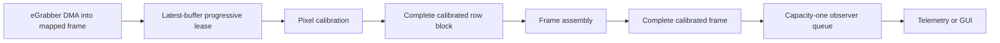
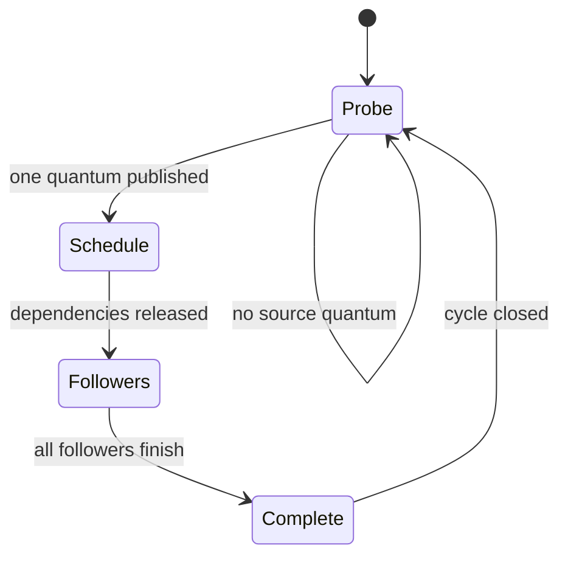

# Scheduled nodes and progressive row blocks

This is the implemented execution and buffer model for the PipeWireAO SPA
plugins. It replaces private per-node RTC execution for production nodes while
preserving zero-copy progressive eGrabber readout at one explicit boundary.

## Result

All complete artifacts use ordinary `SPA_IO_Buffers` and regular PipeWire
dependency scheduling. Sources that cannot expose a useful readiness file
descriptor use `SPA_NODE_FLAG_POLL_DRIVER` on a named busy-spin data loop. The
flag makes the source a polled graph driver; it does not opt the rest of the
graph out of `module-scheduler-v1`.

The exceptional progressive path is:



`SPA_META_Progressive` describes which rows of the camera buffer are immutable.
Pixel calibration is the only Calculon node that reads this changing metadata.
Its output is no longer progressive: every `[N,width]` ndarray is a complete,
immutable, normally leased buffer.

## Node matrix

| Factory | Driver or follower | Process wake | Port I/O |
| --- | --- | --- | --- |
| `api.fits.source` | driver | busy polling | ordinary complete output |
| `api.bgapi2.source` | driver | busy polling | ordinary complete output |
| `api.aravis.source` | driver | busy polling | ordinary complete output |
| `api.egrabber.source` | driver | busy polling | retained latest/progressive output boundary |
| `api.calculon.pixel-calibration` | follower | graph dependency | latest raw input only; ordinary output |
| `api.calculon.frame-assembly` | follower | graph dependency | ordinary input and output |
| Other Calculon factories | followers | graph dependency | ordinary complete buffers |
| `api.alpao.sink` | follower | graph dependency | ordinary complete input |

No production factory in this repository sets `SPA_NODE_FLAG_RTC_PROCESS` or
constructs `pw_rtc_data_loop`.

## Polling data-loop configuration

Define the polling loop in the process that owns the SPA node's `process()`
method and select it with the existing node loop properties:

```ini
context.data-loops = [
    {
        loop.name = rtc-input
        thread.name = rtc-input
        loop.class = data.rt
        loop.idle = busy-spin
        loop.rt-prio = -1
        thread.affinity = [ 2 ]
    }
    {
        loop.name = observer
        thread.name = observer
        loop.class = data.rt
        loop.idle = eventfd
        loop.rt-prio = -1
        thread.affinity = [ 4 ]
    }
]
```

```ini
node.loop.name = rtc-input
```

For an exported node, this configuration belongs in the client process. The
daemon's remote representation participates in topology and shares the
activation record, but it does not execute the remote node or consume a polling
slot. The activation owner advertises its polling wake policy in that shared
record, so producers omit the eventfd write even across processes.

A local `SPA_NODE_FLAG_POLL_DRIVER` fails preparation unless its selected loop
uses `loop.idle=busy-spin`. This avoids silently falling back to an eventfd or a
timeout-zero syscall-polling path.

## One polled-driver cycle

The source and scheduler have distinct responsibilities:



While the driver activation is `FINISHED`, its busy loop calls the source's
bounded, nonblocking `process()`. `SPA_STATUS_OK` means no quantum is ready. A
data result starts an ordinary graph cycle. The source is not polled again
until the dependency graph finishes. The driver's final self-activation closes
the cycle without calling its source method again, preventing an unscheduled
next quantum from being consumed.

This path has no eventfd write, eventfd read, or kernel polling syscall per
activation. Lifecycle and contended loop-control operations may still enter the
kernel. Busy spinning consumes a reserved CPU and must be qualified with power,
IRQ, affinity, and scheduling policy.

## eGrabber progressive ingress

Progressive mode requires Grablink or Coaxlink
`StartOfCameraReadout`/filled-size behavior and mapped host memory. Configure:

```ini
api.egrabber.progressive = require
api.egrabber.progressive-rows = 8
api.calculon.row-block-rows = 8
```

The row count must be positive, divide detector height, and agree at the camera,
calibration, and assembly nodes. eGrabber publishes at most one newly committed
row quantum per completed graph cycle even when DMA has advanced farther. DMA
still proceeds concurrently.

The progressive buffer's normal chunk stride is one camera row. Its metadata
commit granularity is `N * row_stride`; these values are intentionally
different. Pixel calibration acquire-loads the metadata and exposes only full
rows within the committed prefix. It keeps the camera lease until `COMPLETE` or
`ABORTED`.

Progressive DMA-BUF is not supported because the CPU must observe in-progress
mapped rows. Complete-frame DMA-BUF remains a separate device qualification.
Gigelink does not provide the required progressive event contract and falls
back to complete frames for `offer`; it rejects `require`.

## Row-block identity

Calibration publishes F32 ndarray schema
[`org.calculon.ao.calibrated-pixel-row-block/1`](schemas/calibrated-pixel-row-block-1.md),
shape `[N,width]`, at rate:

```text
frame_rate * height / N
```

It uses existing header fields rather than a new block metadata type:

| Header field | Contract |
| --- | --- |
| `seq` | stable frame identity for every block |
| `offset` | first row of the block |
| `MARKER` | set only on the final block |
| `DISCONT` | loss, abort, invalid input, or prior incomplete frame |
| `pts` | inherited frame timestamp |

The selected flat/background calibration pair is snapshotted at frame start.
A control update cannot split one frame across calibration generations.

## Assembly and observers

`api.calculon.frame-assembly` requires exact sequential offsets for one `seq`.
It copies blocks into one preallocated full-frame workspace. A gap, overlap,
unexpected sequence, or invalid marker abandons the partial frame; the next
published full frame carries `DISCONT`. A discontinuity on any constituent
block is retained on the result.

Complete-frame telemetry and GUI consumers attach after assembly. To prevent a
slow observer from retaining critical buffers or backpressuring the RTC graph,
insert the queue module with:

```ini
queue.max-buffers = 1
queue.overflow = drop-oldest
queue.storage = copy
```

`copy` uses an observer-owned pool and releases the critical input lease after
one bounded copy. `lease` avoids the payload copy but may retain one critical
pool buffer for the queued item and another while downstream holds the
delivered item. Pool sizing must include that ownership budget.

## Failure and overload behavior

- Ordinary critical links backpressure when their bounded buffers are held.
- Progressive abort never publishes a partial calibrated block or assembled
  frame.
- A missing block abandons only its frame and makes loss visible through
  sequence gaps and `DISCONT`.
- The observer queue applies its explicit overflow policy; it does not stall
  the producer under `drop-oldest` or `drop-newest`.
- Independently clocked multi-camera inputs still require an acquisition-key
  join, deadline, and missing-input policy. Scheduler ordering is not a
  semantic rendezvous.
- PipeWire ASYNC mode is a one-cycle scheduling pipeline, not a bounded leaky
  queue and not an observer-isolation policy.

## What remains to qualify

The automated suite covers all complete-frame factories and a synthetic
progressive calibration-to-assembly path. It does not establish a deployment
latency bound. Promotion requires connected Grablink/Coaxlink testing,
fixed-arrival p50/p99/p99.9/max measurements, overload and restart cases, CPU
and IRQ placement, and a deliberately stalled observer in both queue storage
modes.
