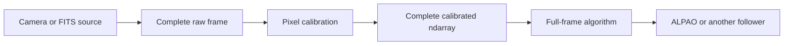
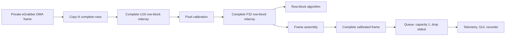
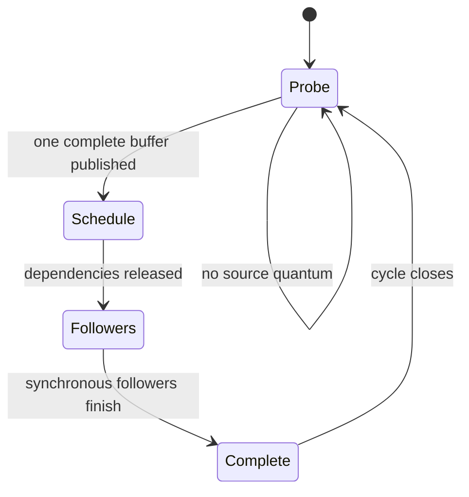

# Scheduled nodes and row-block ndarrays

This is the implemented execution and buffer model for the PipeWireAO SPA
plugins. Production nodes use the regular PipeWire scheduler and ordinary
complete buffers. Latency-critical sources can be polled by a named data loop;
eGrabber can publish fixed row-block ndarrays so calibration starts before the
camera finishes the frame. The FITS source can reproduce the same public
artifact boundary on an explicit simulated readout schedule.

## Result

The migration removes four private contracts:

- no `SPA_NODE_FLAG_RTC_PROCESS`;
- no `pw_rtc_data_loop`;
- no latest-buffer transport; and
- no progressively changing buffer metadata.

The remaining PipeWireAO facilities are ordinary ndarray formats, acquisition
metadata, a polling data-loop idle policy, `SPA_NODE_FLAG_POLL_DRIVER`, and
the activation flag that permits polling across processes.

## Node matrix

| Factory | Scheduling role | Wake/readiness | Buffer contract |
| --- | --- | --- | --- |
| `api.fits.source` | graph driver | configured `poll` or `timerfd` | complete planes or simulated complete raw row blocks |
| `api.bgapi2.source` | graph driver | configured `poll` or `eventfd` | complete ordinary output |
| `api.aravis.source` | comparison graph driver | nonblocking camera probe | complete frames or experimental native-GV raw row blocks |
| `api.egrabber.source` | graph driver | nonblocking camera or row-readout probe | complete video frames or complete raw row blocks |
| `api.calculon.pixel-calibration` | follower | graph dependency | complete frame or row-block input and output |
| `api.calculon.frame-assembly` | follower | graph dependency | complete row blocks in, complete frames out |
| Other Calculon factories | followers | graph dependency | ordinary complete ndarrays |
| `api.alpao.sink` | terminal follower | graph dependency | ordinary complete commands |
| `libpipewire-module-queue` | asynchronous topology boundary | separate input/output graphs | ordinary complete buffers |

## Complete-frame topology

Complete-frame camera operation preserves normal PipeWire and camera-pool
ownership:



eGrabber complete-frame mode may announce the negotiated SPA buffers directly
to the camera, including the qualified DMA-BUF path. The camera completes the
whole allocation before the source publishes it.

## Row-block topology

Row-block mode intentionally copies at the eGrabber boundary:



The private camera allocation may still be changing, but every published
PipeWire buffer is complete and immutable. No downstream node observes camera
fill state or retains ownership of an in-progress camera allocation.

## Configuration

A latency-critical source runs on a named polling loop in the process that owns
its SPA `process()` method:

```ini
context.data-loops = [
    {
        loop.name = rtc-input
        thread.name = rtc-input
        loop.class = data.rt
        loop.idle = busy-spin
        loop.rt-prio = -1
        thread.affinity = [ 2 ]
    }
    {
        loop.name = observer
        thread.name = observer
        loop.class = data.rt
        loop.idle = eventfd
        loop.rt-prio = -1
        thread.affinity = [ 4 ]
    }
]
```

Assign the source:

```ini
node.loop.name = rtc-input
```

Select source readiness independently of its data-loop assignment:

```ini
api.bgapi2.readiness = poll       # poll or eventfd
api.fits.readiness = timerfd      # poll or timerfd
```

`poll` is the compatibility default for both factories. It reports
`SPA_NODE_FLAG_POLL_DRIVER`, requires a `busy-spin` loop, and permits a new
publication only after the preceding synchronous graph cycle finishes.
`eventfd` and `timerfd` use ordinary SPA readiness and can run on an eventfd
data loop. They avoid a dedicated spinning CPU but put kernel wakeup and normal
asynchronous xrun behavior back into the latency and overload contract.

eGrabber always reports `POLL_DRIVER` in both complete-frame and row-block
modes because CallbackOnDemand does not expose a readiness fd. Output mode and
wake mechanism are separate contracts.

Configure eGrabber row blocks and the matching Calculon artifact size:

```ini
api.egrabber.output-mode = row-block
api.egrabber.row-block-rows = 8
api.egrabber.detector-profile = detector-profile-id
api.calculon.row-block-rows = 8
```

`N` must be positive, smaller than the detector height, and divide the
height. Row-block eGrabber operation requires qualified
`StartOfCameraReadout` and filled-size support. `frame` is the default
output mode.

For source-to-graph qualification without camera hardware, configure the FITS
source with the same artifact size and an explicit frame readout duration:

```ini
api.fits.output-mode = row-block
api.fits.row-block-rows = 8
api.fits.simulated-readout-time-ns = 250000
api.fits.schema = org.calculon.ao.raw-pixel-row-block/1
api.fits.profile = detector-profile-id
api.calculon.row-block-rows = 8
```

The FITS source preloads and converts the cube before activation. Its uniform
block schedule is an experimental input, not a substitute for measured camera
tap and row-arrival timing.

An exported source configures the polling loop in its client process. The
daemon's remote node participates in topology and shares activation state, but
does not execute or poll the source.

## One polled-driver cycle



While the source activation is `FINISHED`, the polling loop calls its bounded
nonblocking `process()`. `SPA_STATUS_OK` means nothing is ready. A data
status enters the ordinary driver-ready path. The scheduler resets dependency
counts, moves output I/O, and starts one normal graph cycle.

The source is not probed again until that cycle completes. Camera DMA can
continue concurrently, but public artifacts are published at most one per
completed synchronous graph cycle. This prevents the source from consuming a
second block without starting the corresponding dependency cycle.

The polling activation path omits eventfd writes and reads. An eventfd-driven
follower can still consume the same source: wake policy is selected per target.

## Row-block formats

The raw schema is
[`org.calculon.ao.raw-pixel-row-block/1`](schemas/raw-pixel-row-block-1.md):

```text
elementType = U16_LE
shape = [N, width]
layout = ROW_MAJOR
rate = frame_rate * height / N
```

Pixel calibration emits
[`org.calculon.ao.calibrated-pixel-row-block/1`](schemas/calibrated-pixel-row-block-1.md)
with the same shape and rate and `F32_LE` elements.

The calibration source alternatives are exact: a complete `GRAY16_LE` frame,
or the raw row-block ndarray schema. Format negotiation selects one alternative
for the stream. A stream does not mix complete frames and blocks.

## Identity and loss

Every block carries standard `SPA_META_Header`:

| Field | Contract |
| --- | --- |
| `seq` | stable frame/acquisition identity shared by every block |
| `offset` | zero-based first detector row |
| `MARKER` | set only on the final block |
| `DISCONT` | set on the first block after an abandoned or lost frame |
| `CORRUPTED` | set on a corrupt terminal camera block |
| `pts` | final completion timestamp when known; early camera blocks may be invalid |

Offsets are `0, N, 2N, ... height-N`. Consumers must use sequence, offset,
and marker, not arrival time, to identify a frame.

If output storage is unavailable, layout is invalid, readout overlaps, or the
camera aborts, eGrabber abandons the remainder and marks the next frame
discontinuous. It never publishes the final block before terminal camera
completion validates the frame.

Pixel calibration snapshots the selected flat/background pair at offset zero.
It applies one plan to the whole sequence and emits at most one complete
calibrated block per input block.

## Assembly and observer isolation

`api.calculon.frame-assembly` owns a preallocated frame workspace. It accepts
only the next offset for one sequence. A gap, overlap, unexpected sequence,
out-of-range block, or invalid marker abandons the partial frame. Nothing is
published until a complete frame is assembled. The factory accepts any
prepared rank-two ndarray using a standard fixed-width element type and either
native layout. It preserves element bytes, layout, and profile while applying
the configured row-block-to-frame schema mapping, extent, and rate.

For calibrated detector rows, the corresponding factory information is:

```ini
api.calculon.frame-size = 640x480
api.calculon.frame-rate = 500/1
api.calculon.row-block-rows = 8
api.calculon.row-block-schema = org.calculon.ao.calibrated-pixel-row-block/1
api.calculon.frame-schema = org.calculon.ao.calibrated-pixels/1
api.calculon.ndarray-profile = detector-profile-id
api.calculon.ndarray-element-type = F32_LE
api.calculon.ndarray-layout = row-major
```

Telemetry and GUI branches normally attach after assembly. Isolate them with:

```ini
queue.max-buffers = 1
queue.overflow = drop-oldest
queue.storage = copy
```

`copy` copies once into an observer-owned pool and immediately releases the
critical input lease. `lease` avoids the payload copy but may retain one
critical pool buffer for the queued item and another while an observer holds
the delivered item.

The queue is a real asynchronous boundary. Assigning synchronous nodes to two
threads does not by itself overlap graph cycles or prevent a slow observer from
affecting pool reuse.

## What scheduling does not solve

- PipeWire dependency ordering does not match independently clocked cameras by
  acquisition identity.
- ASYNC scheduling is a cycle-indexed pipeline, not a capacity-one leaky queue.
- Polling reduces wake-up latency but does not isolate overload.
- Row blocks change public artifact granularity; all consumers must negotiate
  the block schema or sit after assembly.

Semantic joins keep their acquisition-key, deadline, hold, and missing-input
policies.

## Verification

The automated suite covers complete-frame cameras, the eGrabber camera-backed
ordinary-buffer path, synthetic raw/calibrated row blocks, malformed block
recovery, frame assembly, queue overflow modes, and polling activation.

Deployment qualification still needs the target Grablink/Coaxlink hardware,
pinned-core fixed-arrival latency, p50/p99/p99.9/maximum, xruns, overload,
pause/restart, device failure, and a deliberately stalled observer in both
queue storage modes.
